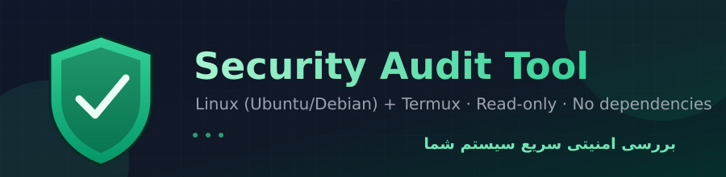
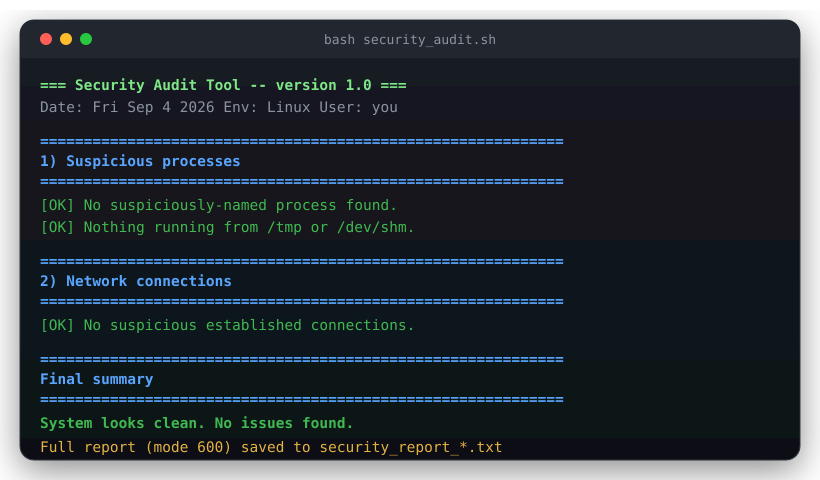

# sec_audio v2.0.0

# sec_audio

<p align="center">
  
</p>

<p align="center">
  <a href="https://github.com/armoury43/sec_audio/actions/workflows/ci.yml"></a>
  <a href="LICENSE"></a>
  
  
  
  <a href="CONTRIBUTING.md"></a>
</p>

<p align="center">
  ابزار خط‌فرمانی برای بررسی امنیتی سریع سیستم‌های <b>لینوکس (Ubuntu/Debian)</b> و
  <b>Termux (اندروید)</b> — تشخیص خودکار محیط، بدون وابستگی خارجی، و کاملاً
  غیرمخرب (فقط بررسی و گزارش می‌دهد).
</p>


## فهرست

- [ویژگی‌ها](#ویژگی‌ها)
- [نصب و اجرا](#نصب-و-اجرا)
- [چه چیزی بررسی می‌شود](#چه-چیزی-بررسی-می‌شود)
- [نمونه خروجی](#نمونه-خروجی)
- [هاردنینگ امنیتی خود ابزار](#هاردنینگ-امنیتی-خود-ابزار)
- [تست‌ها](#تست‌ها)
- [محدودیت‌های شناخته‌شده](#محدودیت‌های-شناخته‌شده)
- [مشارکت](#مشارکت)
- [مجوز](#مجوز)

## ویژگی‌ها

- ✅ یک اسکریپت واحد — خودش تشخیص می‌دهد روی لینوکس اجرا شده یا Termux
- ✅ بدون نیاز به نصب ابزار اضافه (فقط دستورات استاندارد POSIX/GNU)
- ✅ کاملاً **غیرمخرب** — هیچ فایل/پردازش/کرون‌جابی را حذف یا تغییر نمی‌دهد
- ✅ خروجی رنگی و خوانا + فایل گزارش با دسترسی محدود (`600`)
- ✅ پوشش تست خودکار و CI با ShellCheck
- ✅ فارسی، برای کاربران فارسی‌زبان

## نصب و اجرا

### کلون کردن ریپازیتوری

```bash
git clone https://github.com/armoury43/sec_audio.git
cd sec_audio
chmod +x security_audit.sh
```

### روی لینوکس (دسکتاپ/سرور)

```bash
sudo bash security_audit.sh
```

بدون `sudo` هم اجرا می‌شود، اما بررسی کرون‌جاب روت و کل `/etc` ناقص خواهد
بود.

### روی Termux (اندروید)

```bash
pkg install git -y
git clone https://github.com/armoury43/sec_audio.git
cd sec_audio
termux-setup-storage      # اگر قبلاً اجرا نکرده‌اید
chmod +x security_audit.sh
bash security_audit.sh
```

### اجرای مستقیم بدون کلون (یک‌خطی)

```bash
curl -fsSL https://raw.githubusercontent.com/armoury43/sec_audio/main/security_audit.sh -o security_audit.sh \
  && chmod +x security_audit.sh \
  && bash security_audit.sh
```

> 💡 همیشه قبل از اجرای اسکریپت‌های دانلودشده از اینترنت (حتی این یکی)،
> محتوایشان را بخوانید. این توصیه‌ی خودِ این ابزار هم هست!

## چه چیزی بررسی می‌شود

| بخش | توضیح |
|---|---|
| پردازش‌های مشکوک | نام‌های غیرعادی، اجرا از `/tmp`/`/dev/shm`، مصرف بالای CPU/RAM |
| اتصالات شبکه | تمام اتصالات فعال، پورت‌های Listen، اتصالات ESTABLISHED، مسیر پیش‌فرض، رابط‌های شبکه و DNS (در صورت دسترسی) |
| فایل‌های اخیر | دانلودهای ۲۴ ساعت اخیر، فایل‌های اجرایی ۷ روز اخیر، فایل‌های پنهان |
| کرون‌جاب‌ها | کاربر فعلی و روت، فایل‌های `/etc/cron.*` |
| تغییرات سیستم | فایل‌های اخیر `/etc`، `.bashrc`/`.profile`/`.bash_aliases` |
| SSH | کلیدهای مجاز (به‌صورت اثرانگشت)، تعداد `known_hosts` |
| بدافزار شناخته‌شده | xmrig، kinsing، kdevtmpfsi، cryptonight و... |
| ویژه Termux | تاریخچه دستورات، برنامه‌های نصب‌شده روی اندروید |

نتیجه هم روی صفحه (رنگی) و هم در فایل `security_report_*.txt` (دسترسی
`600`، فقط قابل خواندن توسط خودتان) ذخیره می‌شود.

## نمونه خروجی

<p align="center">
  
</p>

> این پیش‌نمایش برای خوانایی جهانی در GitHub به‌صورت نمونه‌ی انگلیسی ساخته
> شده؛ خروجی واقعی ابزار کاملاً **فارسی** است، دقیقاً مثل نمونه‌ی زیر:

<details>
<summary>نمونه‌ی واقعی خروجی فارسی (کلیک کنید تا باز شود)</summary>

```
=== ابزار بررسی امنیتی سیستم — نسخه 1.0 ===
تاریخ: ...
محیط: Linux   کاربر: you

============================================================
  1) پردازش‌های مشکوک
============================================================
[✓ سالم] پردازش با نام مشکوک پیدا نشد.
...
============================================================
  خلاصه نهایی
============================================================
✔ سیستم امن است. هیچ مورد مشکوکی پیدا نشد.
```

</details>

## هاردنینگ امنیتی خود ابزار

چون این ابزار خودش یک اسکریپت امنیتی است، در طراحی‌اش این نکات رعایت شده:

1. **فایل گزارش با دسترسی `600`** ساخته می‌شود — فقط خودِ کاربر می‌تواند
   بخواندش (شامل لیست پردازش‌ها، اتصالات شبکه، اثرانگشت SSH است).
2. **کلید عمومی SSH کامل چاپ نمی‌شود** — فقط نوع/کامنت/اثرانگشت، تا کمترین
   اطلاعات حساس در ترمینال/history باقی بماند.
3. **تمام متغیرها quote شده‌اند** — در برابر نام فایل‌های حاوی فاصله یا
   کاراکترهای خاص (`$()`, backtick، `;`، `|`) مقاوم است؛ این با تست تزریق
   دستور تأیید شده (بخش تست‌ها را ببینید).
4. **بدون `eval`** یا اجرای مستقیم خروجی دستورات دیگر به‌عنوان کد.
5. **جستجوهای سنگین با `timeout` محدود می‌شوند** تا روی سیستم‌های بزرگ هنگ
   نکند.
6. **`set -u`** فعال است تا استفاده از متغیر تعریف‌نشده فوراً مشخص شود.
7. اسکریپت **کاملاً غیرمخرب** است.

## تست‌ها

```bash
chmod +x tests/test_security_audit.sh
bash tests/test_security_audit.sh
```

مجموعه تست شامل ۱۷ سناریو است: سینتکس، اجرای تمیز، تشخیص فایل اجرایی
مشکوک، تشخیص خط مشکوک در `.bashrc`، پردازش امن `authorized_keys` (بدون
افشای کلید کامل)، شبیه‌سازی محیط Termux، مقاومت در برابر نام فایل/مسیر
فاصله‌دار، اجرا با `PATH` محدود، و اثبات غیرمخرب بودن (checksum فایل‌های
کاربر قبل/بعد یکسان می‌ماند).

این تست‌ها به‌صورت خودکار روی هر `push`/`Pull Request` توسط GitHub Actions
هم اجرا می‌شوند (`.github/workflows/ci.yml`)، همراه با ShellCheck.

## محدودیت‌های شناخته‌شده

- جستجوی کلمه‌ی `miner` می‌تواند روی نام پکیج‌های قانونی (مثل کتابخانه‌ی
  پایتون `pdfminer`) هم فعال شود. همیشه **مسیر کامل** فایل پرچم‌خورده را
  بررسی کنید؛ جزئیات در [`docs/remediation_guide.md`](docs/remediation_guide.md).
- جستجوی بدافزار در کل فایل‌سیستم (`find /`) با مهلت ۲۰ ثانیه محدود شده،
  پس روی دیسک‌های خیلی بزرگ ممکن است ناقص باشد.
- در Termux، بدون دسترسی root برخی بخش‌ها (مثل بررسی کامل شبکه یا فایل‌های
  سیستمی) محدودتر هستند — این محدودیت خودِ اندروید است، نه اسکریپت.

## مشارکت

مشارکت‌ها خوش‌آمدند! لطفاً [CONTRIBUTING.md](CONTRIBUTING.md) را قبل از
ارسال Pull Request بخوانید.

برای گزارش آسیب‌پذیری امنیتی، از [SECURITY.md](SECURITY.md) پیروی کنید (نه
Issue عمومی).

## مجوز

این پروژه تحت مجوز [MIT](LICENSE) منتشر شده است.
